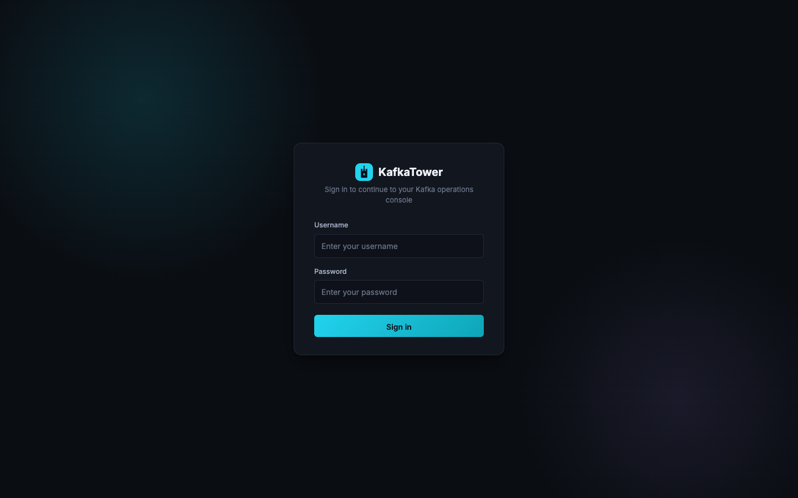
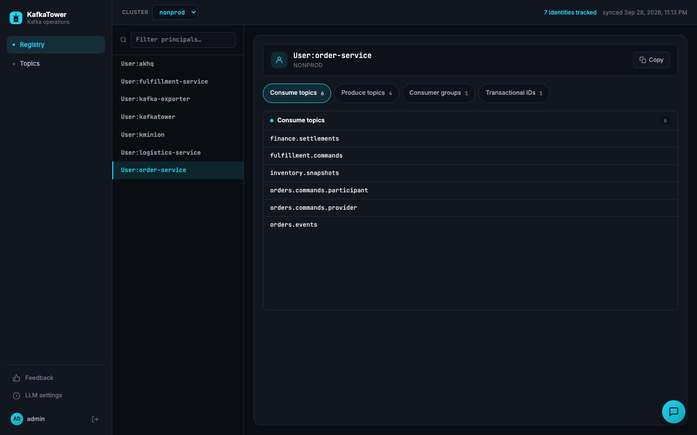
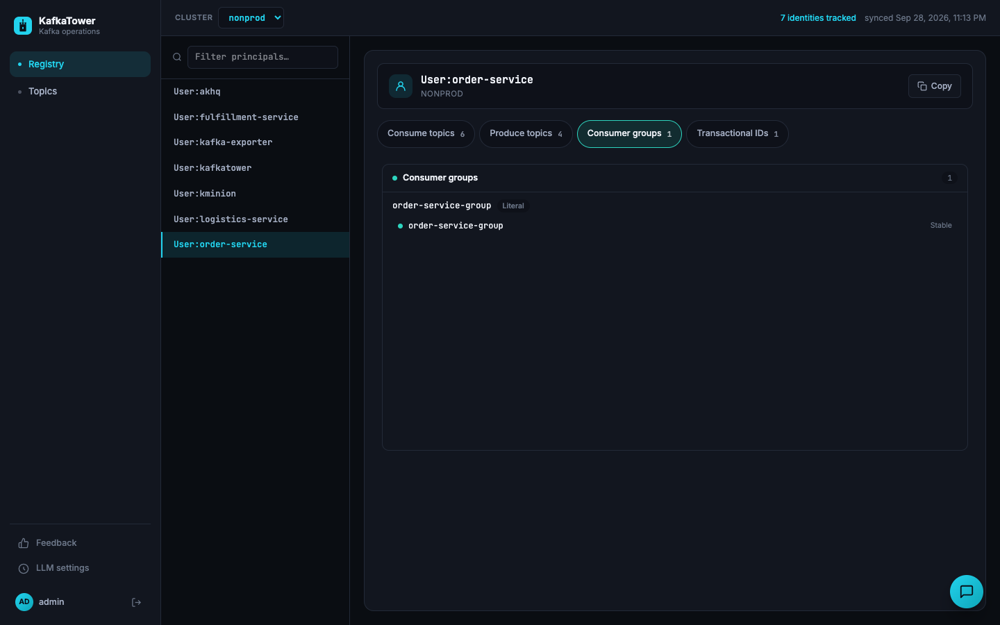
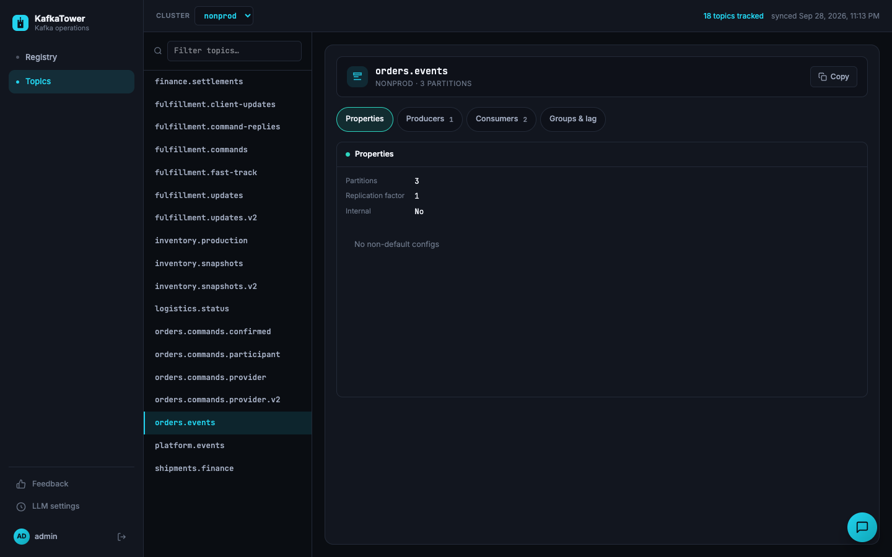
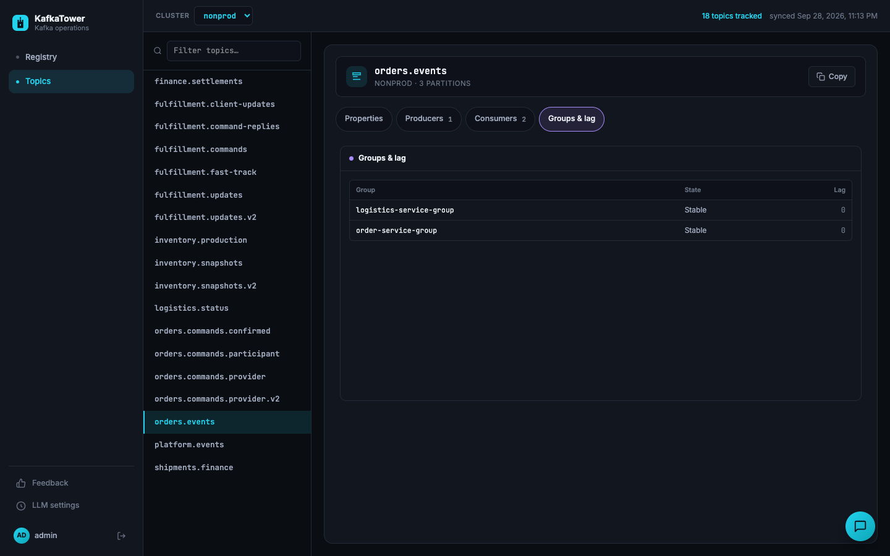
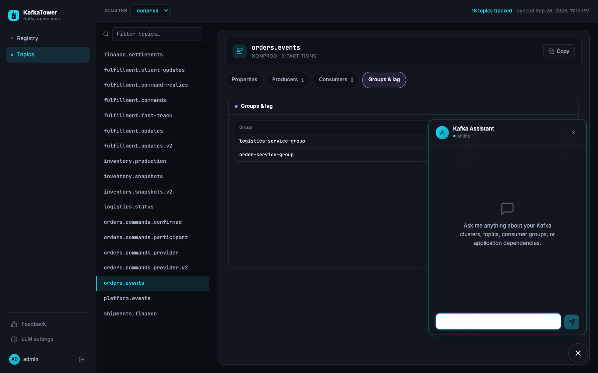

<div align="center">

# KafkaTower

**One calm console for everything happening on your Kafka clusters.**

See who can touch what, which topics are alive, and whether your consumers are keeping up. Ask an AI assistant when you'd rather just ask.



</div>

---

## What it does

### Registry: who can do what

Pick any application identity and see, at a glance, which topics it consumes and produces, which consumer groups it owns, and which transactional IDs it holds. Literal and prefixed grants are labelled, and live group state is shown next to them.





### Topics: what exists and who uses it

Browse every topic in the cluster with its properties, its producers and its consumers.



Jump to **Groups & lag** to see whether each consumer group is stable and how far behind it is.



### Assistant: just ask

Not in the mood to click around? Ask the built-in assistant about your clusters, topics, consumer groups or application dependencies.



### And also

- **Multiple clusters:** switch between them from the header.
- **Sign-in:** the console is protected by a login.

---

## Getting started

### Prerequisites

- Java 21
- Maven 3.9+ (Node is downloaded automatically during the build)
- Docker, if you want the local demo environment

### 1. Start the demo environment (optional)

A local Kafka broker, a few demo applications and a Kafka UI:

```bash
docker compose up -d
```

### 2. Build

```bash
./build.sh
```

`build.sh` is a thin wrapper around `mvn clean package` that uses a project-local Maven repository. You can run plain `mvn clean package` instead.

### 3. Run

```bash
java -jar backend/kafkatower-app/target/kafkatower-app-1.0.0-SNAPSHOT.jar
```

### 4. Open

Go to **http://localhost:8089** and sign in.

| Username | Password   | Role  |
|----------|------------|-------|
| `admin`  | `admin123` | Admin |
| `user`   | `user123`  | User  |

These are development defaults. Change them before exposing the app to anyone.

---

## License

See the repository for license details.
